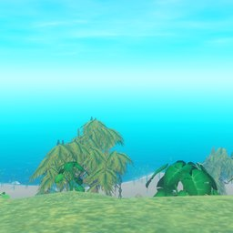
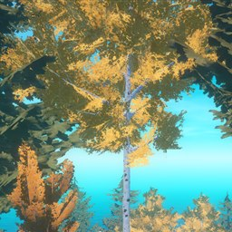
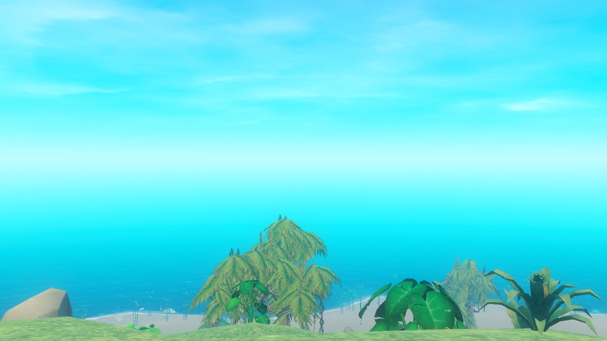
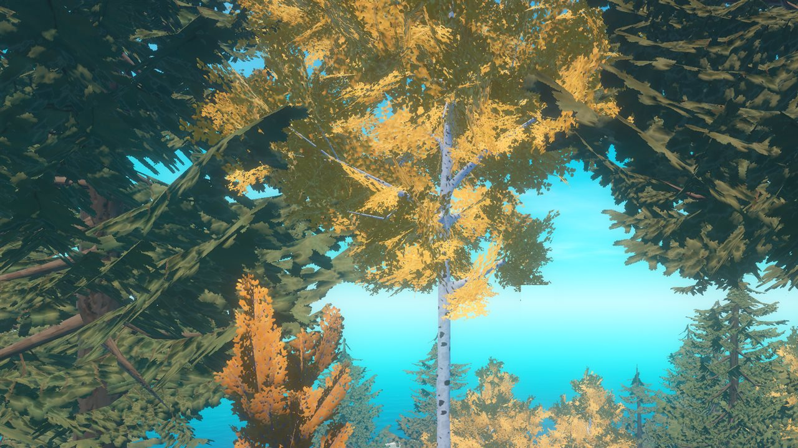

# Custom Islands library

Islands and world plans for the Raft mod **[Custom Islands](https://github.com/SwedenJohansson/DynamicIslands)**, ready to
download.

> **Preview.** The in-game library window that downloads from here isn't built yet. This repository shows how the
> library is laid out, with one island and one plan. Until the window exists, you can copy the files into
> `<Raft>\Mods\DynamicIslands\` by hand (see [Using an entry without the game's library window](#using-an-entry-without-the-games-library-window)).

## What's here

| | Entry | |
|---|---|---|
|  | **[First Voyage](plans/first-voyage)** - world plan by SwedenJohansson<br>A short trip: an old camp, a treasure island its quest points to, and a wreck drifting by.<br>*2 islands, 1-8 players, about 1 hour* | [info](plans/first-voyage/info.json) |
|  | **[Palm Cove](islands/palm-cove)** - island by SwedenJohansson<br>A small island with an abandoned camp and a short quest.<br>*1-8 players, about 15 minutes* | [info](islands/palm-cove/info.json) |

 

## How it's laid out

```
index.json                  the list the game reads - built by tools/build-index.ps1, never edited by hand
islands/<id>/               one folder per island entry
    info.json               title, author, description, tags ...
    icon.jpg                256 x 256, shown in the list
    picture1.jpg ...        1280 x 720, shown when the entry is selected (up to 4)
    <Name>.island           the island
plans/<id>/                 one folder per world plan
    info.json, icon.jpg, picture1.jpg ...
    <Name>.plan             the plan
    <Island>.island ...     every island the plan needs
tools/build-index.ps1       checks every entry and writes index.json (the Build the list workflow runs it)
.github/                    the workflow, and the "Submit an island or plan" form
```

The folder name is the entry's **id**: lower case letters, digits and `-` (e.g. `palm-cove`). It never changes, so the
game can tell when an entry it downloaded has a newer version.

### info.json

```json
{
  "kind": "plan",
  "title": "First Voyage",
  "author": "SwedenJohansson",
  "version": 1,
  "summary": "One line for the list.",
  "description": "Longer text for when the entry is selected.\nLine breaks with \\n.",
  "tags": ["adventure", "quest", "short", "multiplayer"],
  "players": "1-8",
  "length": "about 1 hour",
  "icon": "icon.jpg",
  "pictures": ["picture1.jpg", "picture2.jpg"],
  "plan": "First Voyage.plan",
  "remix": true,
  "featured": true,
  "minModVersion": "3.0",
  "created": "2026-09-28"
}
```

| Field | |
|---|---|
| `kind` | `island` or `plan` (must match the folder it's in) |
| `title`, `author`, `summary`, `icon` | required |
| `version` | a whole number; raise it when the entry changes, so players are offered the update |
| `description`, `tags`, `players`, `length`, `pictures` | optional, shown in the game |
| `plan` | plans only: the plan file in the folder |
| `remix` | whether others may change and re-share it (credit stays with the author) |
| `featured` | shown first, with a badge |
| `minModVersion` | the Custom Islands version it was made with (an older mod warns before installing it) |
| `basedOn` | for a remix: what it's based on and by whom |

An entry has no game settings: difficulty, build cost, the level up system and the rest are chosen by the player in
Raft's New Game box (World settings), whatever plan they pick. Mention in the description what you had in mind, e.g.
"best with Fierce monsters".

`index.json` has all of that for every entry, plus what the build adds: `id`, `path`, `islands` (how many), `size`,
`updated`, and every file with its size and SHA-256 (the game checks each download against it). `download` and `commit`
say where the files are: the commit the list was built from, so the list and the files always match.

## Adding an entry (maintainer)

1. A submission arrives as an issue ("[Submit] ..."). Download its `.zip` and unzip it: it's one folder, already laid out
   as above (info.json, icon, pictures, files), named after the entry's id. Look at it - the pictures, the description,
   and the islands in the game if you like (Import... in the island editor installs the .zip without overwriting yours).
2. On GitHub, open `islands/` or `plans/`, choose **Add file -> Upload files**, drag the whole folder in, and commit.
3. That's all: the **Build the list** workflow (Actions tab) checks the entry and writes `index.json` within a minute or
   two. An entry with a problem - a missing picture, a plan naming an island that isn't in its folder, a file too big, a
   file name the game can't download - is left out, named in the run's log, and the run shows a red cross.
4. Close the issue with a thank-you.

**Update an entry:** a new export of the same island or plan keeps its id and has a higher `version`: replace the folder's
files with the new ones and commit. Players see **Update** in the game. **Remove one:** delete its folder and commit.
Players keep what they already downloaded. **Build the list by hand:** Actions tab -> Build the list -> Run workflow, or
`powershell -File tools\build-index.ps1` in a clone (`-check` only checks).

Limits: icon 200 KB, each picture 500 KB, a whole entry 50 MB.

## Submitting an island or plan (players)

1. In Raft's island editor, pick your island (Islands window) or open your plan (World plans) and click **Export...**.
2. Fill in the title, a summary and a description, take a picture, **Export**.
3. Click **Share...**: it opens the **[Submit an island or plan](../../issues/new?template=submit.yml)** form here and
   the folder with your pack. Sign in to GitHub, drag the `.zip` into the form, tick the box, submit.

It's looked at before it goes in. To send a new version later, export the same island or plan again (it keeps its id)
and submit it the same way. Something in the library that shouldn't be? [Open an issue](../../issues/new).

## Using an entry without the game's library window

Copy the `.island` files into `<Raft>\Mods\DynamicIslands\` and a `.plan` into `<Raft>\Mods\DynamicIslands\plans\`. The
plan then shows up in Raft's New Game box. Careful: a file with the same name as one of yours replaces it. (The library
window will never do that; it keeps both.)

## Licence

Everything in this library is shared under **[Creative Commons Attribution 4.0](LICENSE)** (CC BY 4.0): you may use,
change and re-share an entry, as long as you credit its author. By submitting an entry you confirm you made it and agree
to share it under this licence. An entry whose `remix` is `false` asks you not to share changed versions of it.

Something here that shouldn't be? Open an issue and it will be looked at.
